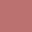
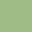
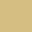
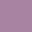

    <h2 align='center'>nymph colorscheme</h2>

 A little dark, soft and pleasing theme for night owls. 

# Colors
<table align="center">
<tr>
    <th>Preview</th>
    <th>Variable</th>
    <th>Hex</th>
    <th>RGB</th>
</tr>
<tr>
    <td></td>
    <td><code>Background</code></td>
    <td><code>#1A2023</code></td>
    <td><code>26, 32, 35</code></td>
</tr>
<tr>
    <td></td>
    <td><code>Lighter Background</code></td>
    <td><code>#252B2E</code></td>
    <td><code>37, 43, 46</code></td>
<tr>
<tr>
    <td></td>
    <td><code>Border</code></td>
    <td><code>#373D40</code></td>
    <td><code>55, 61, 64</code></td>
</tr>
<tr>
    <td></td>
    <td><code>Red</code></td>
    <td><code>#BC7171</code></td>
    <td><code>188, 113, 113</code></td>
</tr>
<tr>
    <td></td>
    <td><code>Green</code></td>
    <td><code>#9FBC85</code></td>
    <td><code>159, 188, 133</code></td>
</tr>
<tr>
    <td></td>
    <td><code>Yellow</code></td>
    <td><code>#D5BE82</code></td>
    <td><code>213, 190, 130</code></td>
</tr>
<tr>
    <td></td>
    <td><code>Blue</code></td>
    <td><code>#7C9BB4</code></td>
    <td><code>124, 155, 180</code></td>
</tr>
<tr>
    <td></td>
    <td><code>Magenta</code></td>
    <td><code>#A883A2</code></td>
    <td><code>168, 131, 162</code></td>
</tr>
<tr>
    <td></td>
    <td><code>Cyan</code></td>
    <td><code>#89B7B0</code></td>
    <td><code>137, 183, 176</code></td>
</tr>
<tr>
    <td></td>
    <td><code>Comment</code></td>
    <td><code>#5B6265</code></td>
    <td><code>91, 98, 101</code></td>
</tr>
<tr>
    <td></td>
    <td><code>Foreground</code></td>
    <td><code>#BCC4C9</code></td>
    <td><code>188, 196, 201</code></td>
</tr>
</table>
