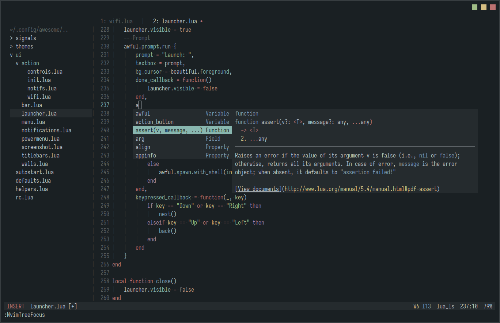
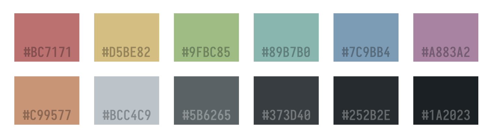

<p align='center'>
    <h2 align='center'>Ennui colorscheme</h2>
</p>
<p align='center'> A little dark, soft and pleasing theme for night owls. </p>

# Preview
<div align="center">
     
</div>

# Colors


## Instalation

Using `Lazy.nvim`:

```lua
{'myagko/nymph.nvim'}
```

## Usage

### Lua

Add this line to your `init.lua` file:<br>
```lua
vim.cmd('colorscheme nymph')
```

### Vimscript

Add this line to your `init.vim` file (for Neovim) or `.vimrc` (for Vim):<br>
```vim
colorscheme nymph
```
