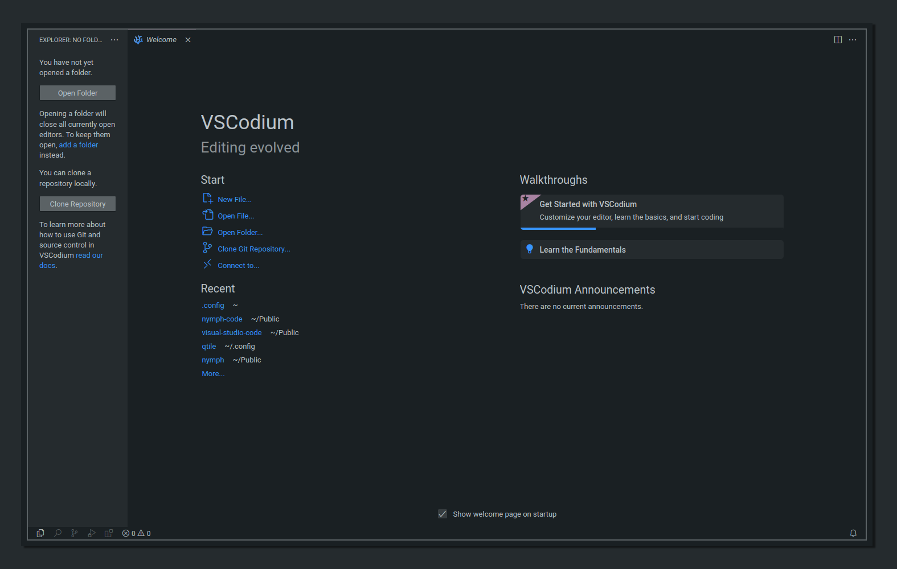
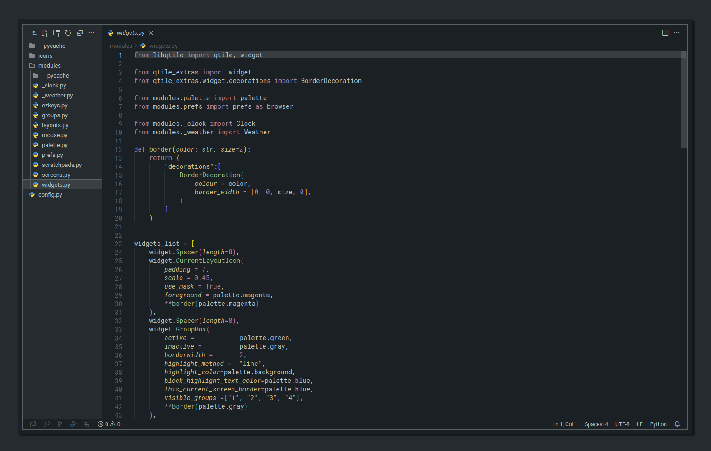

  
   
  <h3 align="center"A clean dark theme for vscode-oss based myagko's theme</h3>

 
 

  

  

## Installation

* To install the extension copy it into the `<user home>/.vscode-oss/extensions` folder and restart Code.
* Open `File > Preferences > Color Themes` and pick nymph color theme.
